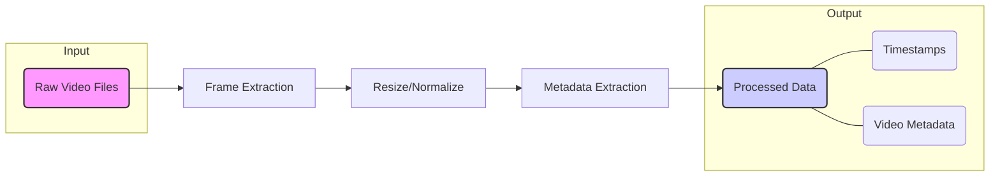
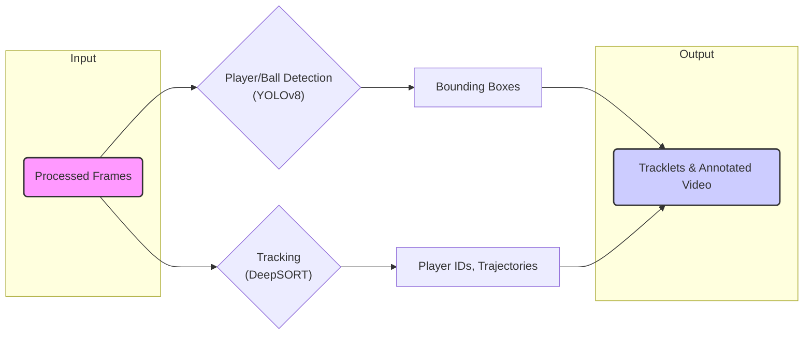
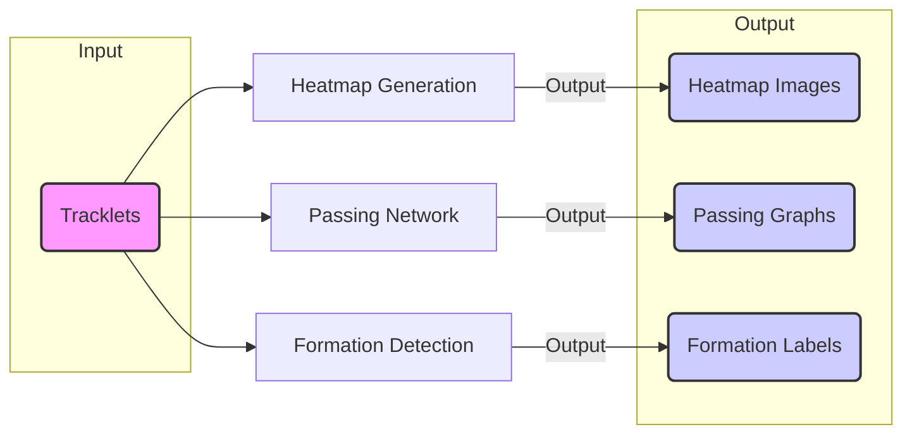
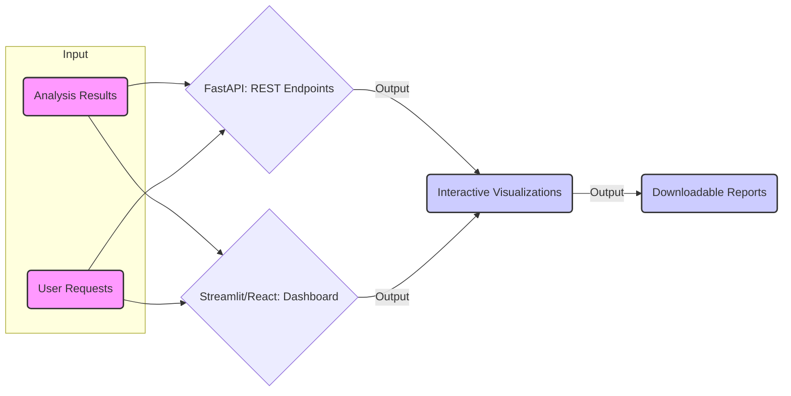
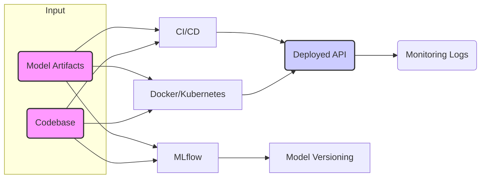

# 🏗️ System Architecture Diagrams

This document contains detailed flow diagrams for each major component of the AI-Based Football Analyzer system.

## Data Pipeline Flow

## Detection & Tracking Flow

## Strategy Analysis Flow

## API & Web App Flow

## MLOps & Deployment Flow
