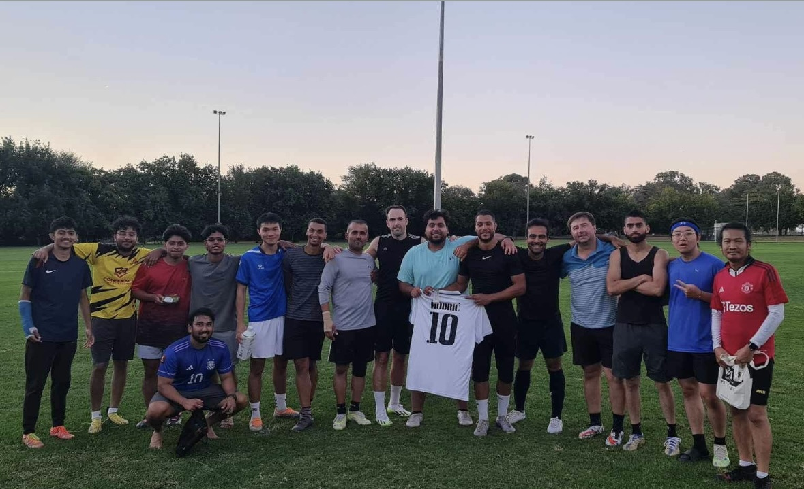

# ⚽ AI-Based Football Analyzer



## 📌 Overview

AI-powered football analysis tool for real-time player & ball tracking, strategy analysis, and insightful visualizations.

---

## 🏗️ System Design & Architecture

For detailed flow diagrams of each system component, please visit [System Architecture Diagrams](ARCHITECTURE.md).

### 🔹 Components & Dependencies

1. **📥 Data Pipeline**
   - Ingestion: Convert videos → frames
   - Preprocessing: Resize, normalize
   - Storage: Cloud (AWS S3) / Local

2. **🎯 Detection & Tracking**
   - **YOLOv8**: Player/ball detection
   - **DeepSORT**: Multi-object tracking
   - **Trajectory Extraction**

3. **📊 Strategy Analysis**
   - Heatmaps & passing networks
   - Formation detection (CNNs, LSTMs, clustering)

4. **🖥️ API & Web App**
   - **FastAPI**: Backend with REST API
   - **Streamlit/React**: Interactive dashboard

5. **🔧 MLOps & Deployment**
   - **CI/CD**: GitHub Actions
   - **Experiment Tracking**: MLflow
   - **Monitoring**: Prometheus/Grafana

---

## 🛠️ Tools & Frameworks

| Category       | Tools & Frameworks |
|---------------|------------------|
| **CV/ML**     | OpenCV, PyTorch, YOLO, Detectron2, Scikit-learn |
| **Data**      | DVC, Label Studio, AWS S3 |
| **Backend**   | FastAPI, Celery, Redis, PostgreSQL |
| **Frontend**  | Streamlit, React, Plotly, D3.js |
| **Deployment**| Docker, Kubernetes, AWS/GCP |
| **MLOps**     | MLflow, GitHub Actions, Prometheus |

---

## 📅 Timeline & Milestones

| **Phase** | **Duration** | **Milestones** | **Status** |
|----------|------------|-----------------|------------|
| **📌 System Design** | 2 weeks | Architecture diagram, tool selection, dataset sourcing plan | ✅ |
| **📥 Data Pipeline** | 3 weeks | Video ingestion, preprocessing, annotation (200+ labeled videos) | ✅ |
| **🎯 Detection & Tracking** | 4 weeks | YOLOv8 model (mAP ≥80%), DeepSORT (MOTA ≥70%) | ✅ |
| **📊 Strategy Analysis** | 3 weeks | Heatmaps, passing accuracy (≥85% F1-score), formation detection | ❌ |
| **🖥️ API & Web App** | 3 weeks | Functional API endpoints, interactive dashboard | ❌ |
| **🚀 MLOps & Deployment** | 2 weeks | CI/CD pipeline, model monitoring, Dockerized deployment | ❌ |
| **📚 Documentation** | Ongoing | Tutorials, API docs, contribution guidelines | ✅ |


---

## 📁 Repository Structure

```
football-analyzer/
├── data/                   # Raw/processed data (DVC linked)
├── models/                 # Pretrained weights, model definitions
├── notebooks/              # EDA, prototyping (detection, tracking, analysis)
├── src/
│   ├── data_pipeline/      # Video ingestion, preprocessing
│   ├── archive/            # unsed codes
│   ├── tracking/           # Yolo & Bytetrack integration
│   ├── analysis/           # Strategy algorithms
│   ├── api/                # FastAPI backend
│   └── webapp/             # Streamlit/React frontend
├── tests/                  # Unit/integration tests
├── docs/                   # Sphinx/MkDocs, tutorials
├── .github/                # CI/CD workflows
├── Dockerfile              # Containerization
└── README.md               # Setup, usage, contribution guide
```

---

## 🔑 Key Implementation Steps

✅ **Data Collection**
   - Use **SoccerNet**, YouTube matches, or synthetic data.
   - Annotate players/ball using **Label Studio** (COCO/YOLO format).

✅ **Detection Model**
   - Fine-tune **YOLOv8** on annotated data.
   - Optimize inference with **ONNX/TensorRT**.

✅ **Tracking**
   - Implement **DeepSORT** with custom ReID embeddings.

✅ **Strategy Analysis**
   - Generate heatmaps (OpenCV), passing networks (NetworkX), and formations (DBSCAN).

✅ **API**
   - Async video processing (**Celery + Redis**), JWT authentication.

✅ **Frontend**
   - Upload video → display tracking, heatmaps, and strategy insights.

---

## ⚖️ Fairness, Efficiency & Scalability

🔹 **Fairness**: Test across diverse leagues, lighting conditions, camera angles.  
🔹 **Efficiency**: Pruning, YOLO quantization, **TensorRT** optimization.  
🔹 **Scalability**: Kubernetes cluster (**AWS EKS/GCP GKE**), auto-scaling API.  

---

## 🚀 Deployment Strategies

📌 **Real-Time**: Optimize model latency (<100ms/frame) using **ONNX/TensorRT**.  
📌 **Post-Game**: Batch processing via **AWS Batch/Airflow**.  
📌 **Cost Control**: Use **spot instances**, model caching, **CDN** for assets.  

---

## 📚 Documentation & Community

📌 **README**: Quickstart, architecture, demo GIFs.  
📌 **Wiki**: Tutorials (data annotation, model training), API specs.  
📌 **Examples**: Jupyter notebooks for detection, tracking, analysis.  
📌 **Contributing.md**: Code standards, issue templates, PR guidelines.  

---

## ⚠️ Challenges & Mitigation

⚠️ **Occlusions**: Augment data, test MOTA in crowded scenes.  
⚠️ **Scalability**: Use Redis for task queues, load test with **Locust**.  
⚠️ **Ethics**: Avoid personal data; use only public match footage.  

---

## 🎯 Conclusion

By following this structured plan, you'll build a **robust, scalable, and community-driven** AI-based football analyzer. 🚀⚽

> **"Success in football and AI depends on strategy, precision, and execution."** 💡

